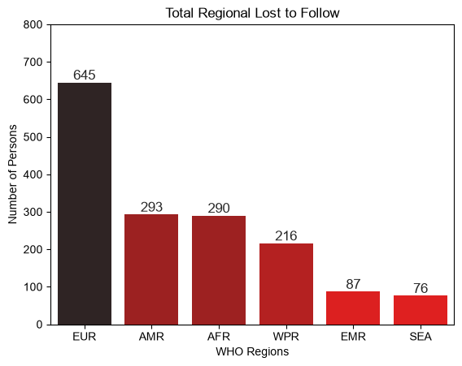
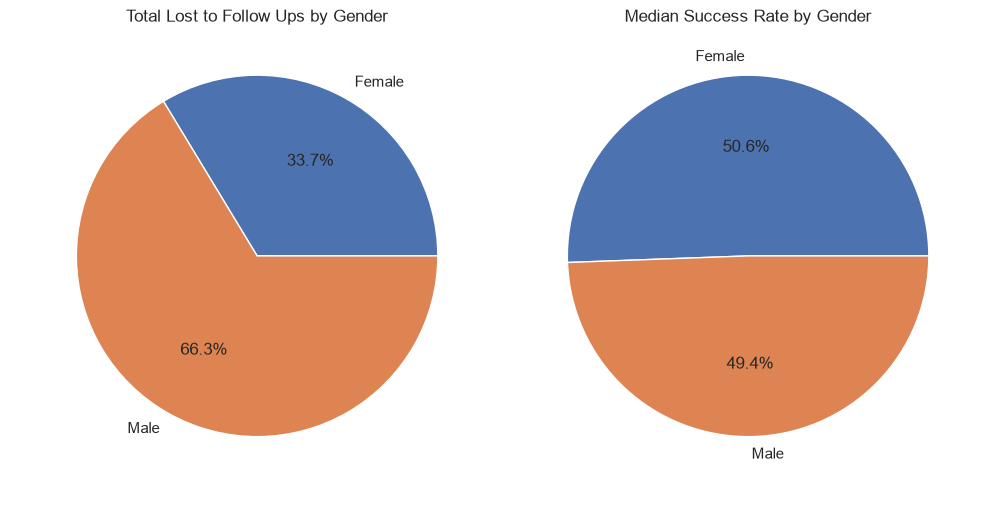
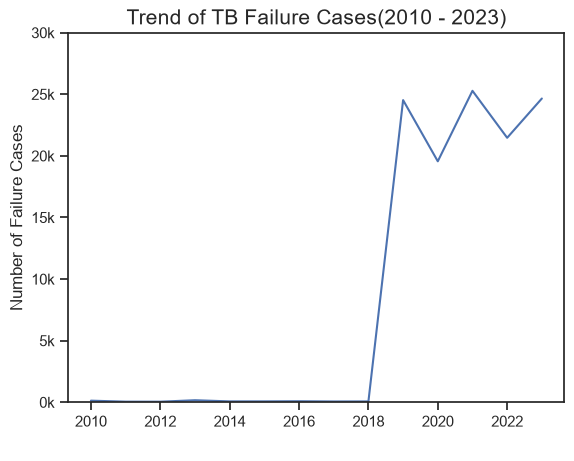
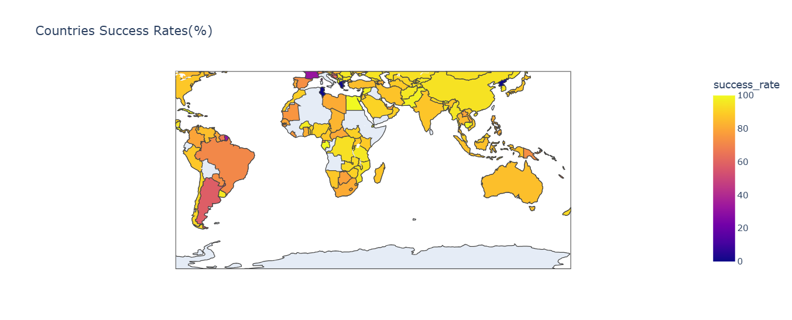
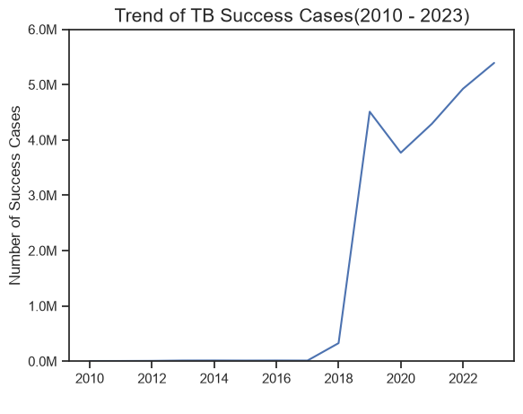

# 🩺 Global Tuberculosis (TB) Treatment Outcomes Analysis (2010–2023)

> A comprehensive healthcare data analytics project exploring global Tuberculosis treatment outcomes using Python, with a focus on treatment success, treatment failure, and loss-to-follow-up trends across WHO regions and countries.

---

# Project Overview

Tuberculosis (TB) remains one of the world's most significant public health challenges despite decades of prevention and treatment efforts. Understanding treatment outcomes across different regions is critical for identifying healthcare system gaps, evaluating intervention effectiveness, and guiding evidence-based policy decisions.

As someone deeply interested in healthcare analytics and the use of data to improve health outcomes, I undertook this project to analyze **[global TB treatment data published by the World Health Organization (WHO)](https://www.who.int/teams/global-tuberculosis-programme/data?utm_source=chatgpt.com)**. The objective was to transform raw epidemiological data into meaningful insights capable of supporting public health decision-making.

This project demonstrates my ability to:

- Perform real-world healthcare data cleaning and preparation
- Conduct exploratory data analysis (EDA)
- Build meaningful visualizations
- Interpret healthcare metrics critically
- Communicate findings in a data-driven manner
- Apply Python for public health research

---

# Background

Tuberculosis affects millions of people globally every year. While treatment is generally effective when completed, treatment interruptions, treatment failures, and patient loss-to-follow-up remain major barriers to disease control.

The World Health Organization tracks treatment outcomes globally through annual surveillance systems. These outcomes provide valuable insights into:

- Healthcare accessibility
- Treatment adherence
- Program effectiveness
- Regional disparities
- Disease management performance

This analysis focuses on understanding:

1. Which WHO regions experience the highest loss-to-follow-up rates.
2. How treatment success has evolved over time.
3. Whether treatment failures are increasing or decreasing.
4. Gender-related treatment outcome patterns.
5. Global geographical variations in treatment success.

---

# Dataset Source

**Data Source:** World Health Organization (WHO) Tuberculosis Database

🔗 **WHO Dataset Link:** [Dataset](https://www.who.int/teams/global-tuberculosis-programme/data?utm_source=chatgpt.com)

The WHO TB database is one of the most authoritative sources of global tuberculosis surveillance data and is widely used by governments, researchers, and public health organizations worldwide.

---

# Tools & Technologies

| Tool | Purpose |
|--------|----------|
| Python | Data Cleaning, Analysis & Visualization |
| Pandas | Data Manipulation |
| NumPy | Numerical Operations |
| Matplotlib | Visualization |
| Seaborn | Statistical Visualization |
| Plotly | Interactive Geospatial Mapping |
| VS Code | Development Environment |
| Anaconda | Python Environment Management |
| Git & GitHub | Version Control & Project Hosting |

---

# Data Cleaning & Preparation

Real-world healthcare datasets are rarely analysis-ready. Before performing any analysis, extensive data cleaning was conducted to improve reliability and consistency.

### Cleaning Steps Performed

✔ Removed duplicate records

✔ Handled missing values

✔ Standardized column names

✔ Converted incorrect data types

✔ Fixed inconsistent categorical entries

✔ Renamed variables for readability

✔ Created derived variables where necessary

✔ Validated numerical columns

✔ Filtered unusable observations

✔ Structured data for analysis and visualization

### Why This Matters

Healthcare analytics is only as reliable as the underlying data. Proper cleaning reduces bias, improves reproducibility, and increases confidence in analytical conclusions.

---

# Data Import & Cleaning Code

## Code Snippet 1: Data Import

```python
import pandas as pd

df = pd.read_csv("C:\\Users\\HomePC\\Downloads\\TB_outcomes_age_sex_2026-07-03.csv",
             index_col='country', 
            names=['country','iso2','iso3','iso_numceric','WHO_region','year','cohort_type',
                     'age_group','sex','total_patients_cohort','success','failure','deaths',
                     'lost_to_follow_up','not_evaluated','success_rate'])
```

---

## Code Snippet 2: Data Cleaning

```python
df = df.drop(labels='country', axis=0)

sex_full = []
for data in df['sex']:
    if data == 'f':
        sex_full.append('Female')
    elif data == 'm':
        sex_full.append('Male')
    elif data == 'a':
        sex_full.append('All sexes')

df['sex'] = sex_full


ages= []

for age in df['age_group']:
    if age == 'a':
        ages.append('All ages')
    else:
        ages.append(age)


df['age_group'] = ages


df['total_patients_cohort'] = pd.to_numeric(df['total_patients_cohort'], errors='coerce')
df['success'] = pd.to_numeric(df['success'], errors='coerce')
df['failure'] = pd.to_numeric(df['failure'], errors='coerce')
df['deaths'] = pd.to_numeric(df['deaths'], errors='coerce')
df['lost_to_follow_up'] = pd.to_numeric(df['lost_to_follow_up'], errors='coerce')
df['not_evaluated'] = pd.to_numeric(df['total_patients_cohort'], errors='coerce')
df['success_rate'] = pd.to_numeric(df['success_rate'], errors='coerce')
df['year'] = pd.to_numeric(df['year'], errors='coerce')
```

---

# Exploratory Data Analysis (EDA)

The exploratory phase focused on identifying trends, regional disparities, treatment outcomes, and demographic patterns.

---

# Analysis 1: Regional Loss-to-Follow-Up Burden

## Visualization



### Code

```python
tb_lost = df.groupby('WHO_region')['lost_to_follow_up'].size().sort_values(ascending=False).reset_index()


n_lost = sns.barplot(data=tb_lost, 
            x='WHO_region', 
            y='lost_to_follow_up',
            hue='lost_to_follow_up',
            palette='dark:r_r',
            legend = False
            )

sns.set_theme(style='ticks')

plt.ylim(0,800)
plt.xlabel('WHO Regions')
plt.ylabel('Number of Persons')
plt.title('Total Regional Lost to Follow')

for label in n_lost.containers:
    n_lost.bar_label(label, fmt='%.0f')

plt.show()

```

### Findings

The European Region (EUR) recorded the highest number of patients lost to follow-up, accounting for **645 cases**, significantly exceeding all other WHO regions.

| Region | Cases |
|----------|----------|
| EUR | 645 |
| AMR | 293 |
| AFR | 290 |
| WPR | 216 |
| EMR | 87 |
| SEA | 76 |

### Interpretation

Loss-to-follow-up is one of the most critical indicators in TB management because treatment interruption increases:

- Drug resistance risk
- Disease transmission
- Mortality
- Program inefficiency

The unexpectedly high burden observed in Europe suggests that treatment adherence challenges may not be limited to low-resource settings. Social determinants, migration patterns, healthcare access disparities, and patient mobility may contribute significantly.

### Key Insight

Regions with strong healthcare systems can still face substantial patient retention challenges.

---

# Analysis 2: Treatment Outcomes by Gender

## Visualization



### Code

```python
tb_gender = df[df['sex']!='All sexes'].pivot_table(
    index='sex',
    values='lost_to_follow_up',
    aggfunc='sum'
    )

tb_gender2 = df[df['sex']!='All sexes'].pivot_table(
    index='sex',
    values='success_rate',
    aggfunc='median'
    )

fig, ax = plt.subplots(1,2)
tb_gender_plot= tb_gender.plot(kind='pie', autopct='%.1f%%', y='lost_to_follow_up',ax=ax[0], figsize=(10,6), legend=False)
ax[0].set_title('Total Lost to Follow Ups by Gender')
ax[0].set_xlabel(' ')
ax[0].set_ylabel(' ')

tb_gender2_plot = tb_gender2.plot(kind='pie',y='success_rate', autopct='%.1f%%', ax=ax[1], legend=False, figsize=(10,6))
ax[1].set_title('Median Success Rate by Gender')
ax[1].set_ylabel(' ')
ax[1].set_xlabel(' ')

fig.tight_layout()
```

### Findings

#### Loss-To-Follow-Up

- Male: 66.3%
- Female: 33.7%

#### Median Success Rate

- Female: 50.6%
- Male: 49.4%

### Interpretation

Male patients appear substantially more likely to discontinue treatment than female patients.

Meanwhile, treatment success rates remain relatively balanced, with females showing a slight advantage.

Potential contributing factors include:

- Healthcare-seeking behaviors
- Occupational mobility
- Treatment adherence differences
- Access to care
- Social and economic influences

### Key Insight

Gender-sensitive interventions may improve treatment completion and reduce losses during treatment.

---

# Analysis 3: Global Trend of TB Treatment Failure

## Visualization



### Code

```python
tb_failure = df[df['failure'].notna()].groupby(['year'])['failure'].sum().sort_values(ascending=False).reset_index()

fig, ax = plt.subplots()
sns.set_theme(style='ticks')
sns.lineplot(
    data=tb_failure,
    x='year',
    y='failure',
    legend=False,
    ax=ax
)

plt.ylim(0,30000)
plt.gca().yaxis.set_major_formatter(plt.FuncFormatter(lambda y, _: f'{y/1000:.0f}k'))
plt.title('Trend of TB Failure Cases(2010 - 2023)', fontsize=15)
plt.xlabel(' ')
plt.ylabel('Number of Failure Cases')
plt.show()
```

### Findings

Treatment failure cases remained relatively low before a sharp increase beginning around 2019.

The period between 2019 and 2023 exhibits significantly higher failure counts compared to earlier years.

### Interpretation

Several factors may explain this trend:

- Increased reporting coverage
- Improved surveillance systems
- Drug-resistant TB burden
- Healthcare disruptions
- Pandemic-related treatment interruptions

### Important Consideration

The sudden increase warrants additional investigation before drawing causal conclusions. Trend changes may reflect both epidemiological realities and reporting improvements.

### Key Insight

Monitoring treatment failure trends remains essential for detecting emerging public health threats.

---

# Analysis 4: Global Distribution of TB Treatment Success

## Visualization



### Code

```python
tb_region = df.groupby(['iso3'])['success_rate'].median()
tb_region = tb_region.reset_index()

fig = px.choropleth(
    tb_region,
    locations='iso3',
    color='success_rate',
    title='Countries Success Rates(%)'
)

fig.show()
```

### Findings

The global map reveals substantial geographical variation in treatment success rates.

Several countries demonstrate exceptionally high treatment success, while others show lower performance levels.

### Interpretation

Differences may arise from:

- Healthcare infrastructure
- Drug availability
- Program funding
- Patient adherence
- Public health policy effectiveness

### Key Insight

Geographical visualization helps identify regions requiring targeted interventions and resource allocation.

---

# Analysis 5: Global Trend of TB Treatment Success

## Visualization



### Findings

Treatment success cases increased dramatically between 2018 and 2023.

The upward trajectory suggests substantial progress in TB treatment programs globally.

### Interpretation

This pattern may indicate:

- Improved treatment access
- Better patient management
- Enhanced surveillance systems
- Expansion of TB control programs
- Increased reporting coverage

Although success rates improved, treatment failures and losses-to-follow-up remain important challenges that must continue to be addressed.

### Key Insight

Global TB treatment efforts appear to be producing measurable improvements in patient outcomes.

---

# Correlation Between Findings

Several important relationships emerge when these analyses are viewed together:

### Observation 1

Treatment success is increasing globally.

### Observation 2

Treatment failures also show growth in recent years.

### Observation 3

Certain regions continue to experience high loss-to-follow-up rates.

### Interpretation

These findings suggest that:

- More patients are entering treatment programs.
- More patients are successfully completing treatment.
- However, healthcare systems still struggle with patient retention and treatment continuity.

This reflects a healthcare system improving in scale but still facing operational challenges.

---

# What I Learned

Through this project, I strengthened my skills in:

### Technical Skills

- Data Cleaning
- Exploratory Data Analysis
- Statistical Thinking
- Data Visualization
- Geospatial Analysis
- Git & GitHub Workflow
- Healthcare Data Interpretation

### Analytical Skills

- Translating healthcare data into actionable insights
- Identifying patterns and anomalies
- Evaluating treatment outcomes
- Communicating findings effectively

### Professional Skills

- Documentation
- Research methodology
- Reproducible analytics
- Project organization

---

# Project Structure

```text

├── project_files/
│   ├── 1_import_and_data_cleaning.ipynb
│   └── 2_analysis.ipynb
│
├── assets/
│   ├── region_LTFU.png
│   ├── succes_LTFU_comparison.png
│   ├── tb_failure_trend.png
│   ├── tb_success_distribution.png
│   └── tb_success_trend.png
│
├── README.md

```

---

# Project Credibility

### Data Source Credibility

- World Health Organization (WHO)
- Internationally recognized public health authority
- Used by governments, researchers, and healthcare organizations globally

### Methodological Credibility

- Structured data cleaning process
- Transparent analytical workflow
- Reproducible Python code
- Visual validation of findings

### Limitations

- Results depend on reported surveillance data.
- Missing data from some countries may affect comparisons.
- Correlation does not imply causation.
- Further statistical modeling would be required for predictive conclusions.

---

# Conclusion

This project demonstrates the practical application of data analytics in global healthcare. By transforming raw WHO tuberculosis data into meaningful insights, I explored treatment success, treatment failure, and patient retention patterns across regions, genders, and time.

The analysis revealed encouraging improvements in treatment success while also highlighting persistent challenges such as loss-to-follow-up and treatment failures. These findings reinforce the importance of continuous monitoring, evidence-based interventions, and data-driven decision-making in global health.

Beyond the healthcare insights generated, this project strengthened my ability to clean, analyze, visualize, and communicate complex real-world data using Python, making it a valuable addition to my growing healthcare analytics portfolio.

---

# Contact

**Chidera John**

📧 Email: chiderajohn@gmail.com

💼 LinkedIn: [View Profile](https://www.linkedin.com/in/john-chidera-jr-0b6b55319/)


---

⭐ If you found this project interesting, feel free to star the repository and connect with me.
